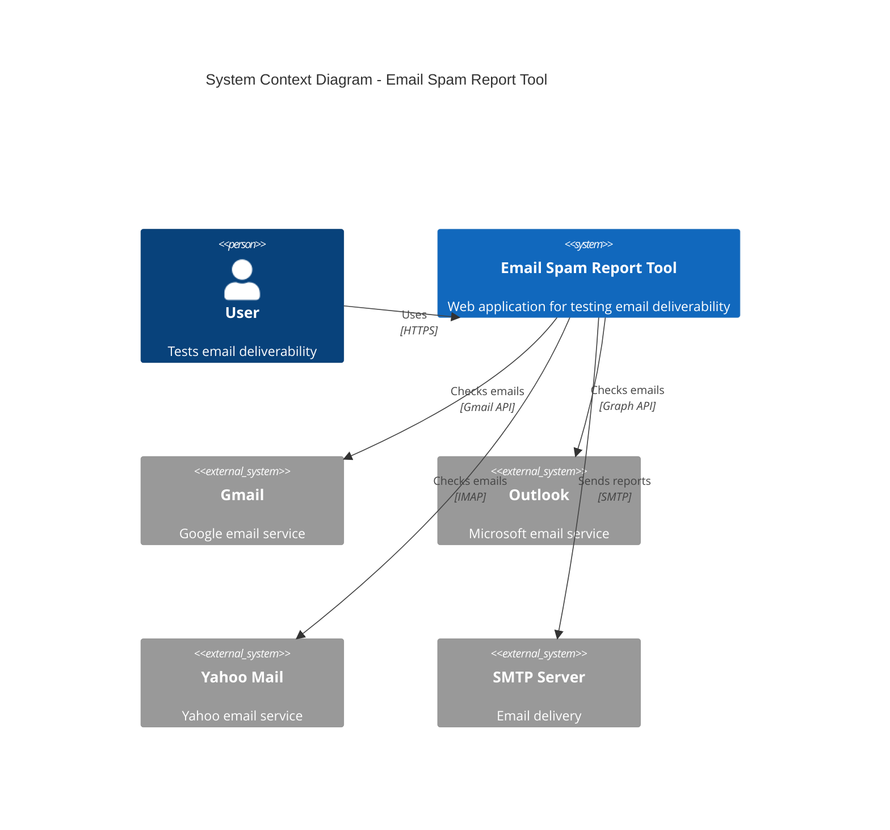
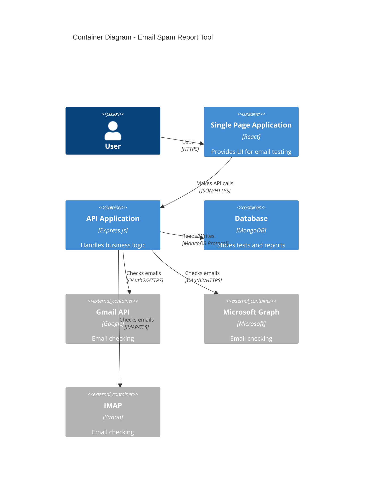
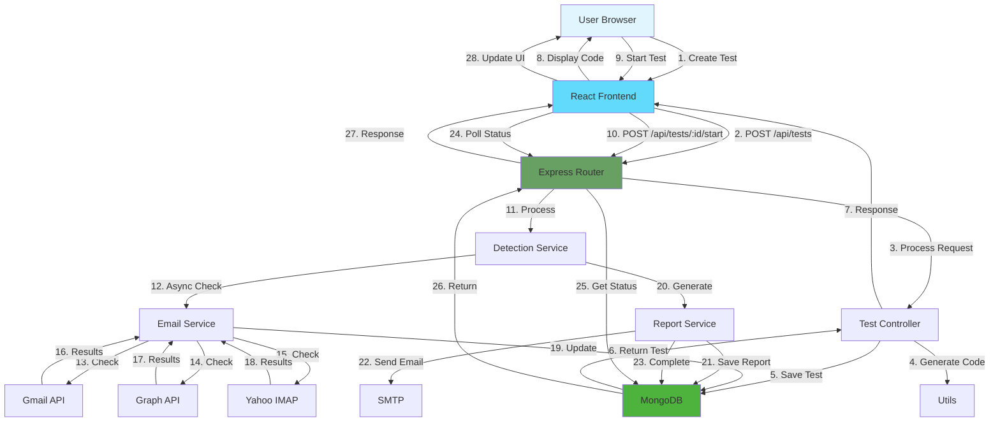

# 🏗️ System Architecture

## High-Level Architecture



## Component Architecture



## Data Flow Architecture



## Folder Structure

```
email-spam-report-tool/
│
├── backend/                      # Node.js Backend
│   ├── config/                   # Configuration files
│   │   ├── database.js          # MongoDB connection
│   │   └── email.config.js      # Email service configs
│   │
│   ├── controllers/              # Request handlers
│   │   ├── test.controller.js   # Test CRUD operations
│   │   └── report.controller.js # Report operations
│   │
│   ├── models/                   # Mongoose schemas
│   │   ├── Test.model.js        # Test document schema
│   │   └── Report.model.js      # Report document schema
│   │
│   ├── routes/                   # API routes
│   │   ├── test.routes.js       # Test endpoints
│   │   └── report.routes.js     # Report endpoints
│   │
│   ├── services/                 # Business logic
│   │   ├── email.service.js     # Email operations
│   │   ├── detection.service.js # Email detection logic
│   │   └── report.service.js    # Report generation
│   │
│   ├── utils/                    # Helper functions
│   │   ├── generateTestCode.js  # Test code generator
│   │   └── emailTemplates.js    # Email HTML templates
│   │
│   ├── middleware/               # Express middleware
│   │   └── errorHandler.js      # Global error handler
│   │
│   ├── .env                      # Environment variables
│   ├── .gitignore               # Git ignore file
│   ├── package.json             # Dependencies
│   └── server.js                # Entry point
│
├── frontend/                     # React Frontend
│   ├── public/                   # Static files
│   │   ├── index.html           # HTML template
│   │   └── favicon.ico          # Favicon
│   │
│   ├── src/
│   │   ├── components/           # React components
│   │   │   ├── TestInboxes.jsx  # Display test inboxes
│   │   │   ├── TestCodeDisplay.jsx # Show test code
│   │   │   ├── TestProgress.jsx # Progress tracker
│   │   │   ├── Report.jsx       # Report display
│   │   │   ├── ReportHistory.jsx # Test history
│   │   │   ├── Loader.jsx       # Loading spinner
│   │   │   └── EmptyState.jsx   # Empty state UI
│   │   │
│   │   ├── pages/                # Page components
│   │   │   ├── Home.jsx         # Landing page
│   │   │   ├── TestPage.jsx     # Test execution page
│   │   │   └── ReportPage.jsx   # Report view page
│   │   │
│   │   ├── services/             # API services
│   │   │   └── api.js           # Axios HTTP client
│   │   │
│   │   ├── utils/                # Helper functions
│   │   │   └── helpers.js       # Utility functions
│   │   │
│   │   ├── styles/               # CSS files
│   │   │   ├── App.css          # Main styles
│   │   │   └── components.css   # Component styles
│   │   │
│   │   ├── App.jsx              # Main app component
│   │   ├── index.js             # Entry point
│   │   └── index.css            # Global styles
│   │
│   ├── .env                      # Environment variables
│   ├── .gitignore               # Git ignore file
│   └── package.json             # Dependencies
│
├── docs/                         # Documentation
│   ├── WORKFLOW.md              # This file
│   ├── ARCHITECTURE.md          # Architecture details
│   ├── API.md                   # API documentation
│   └── SETUP.md                 # Setup instructions
│
├── .gitignore                    # Root git ignore
├── README.md                     # Project overview
└── LICENSE                       # MIT License
```

---

**Continue reading:**
- [API Documentation](API.md)
- [Setup Guide](SETUP.md)
- [Main Workflow](WORKFLOW.md)